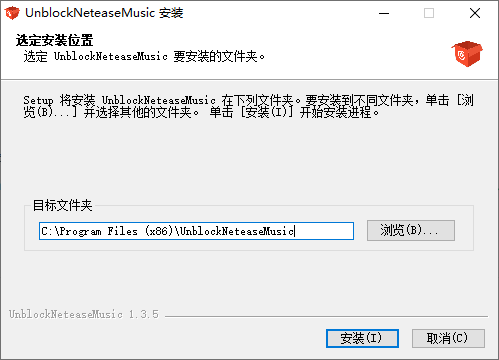
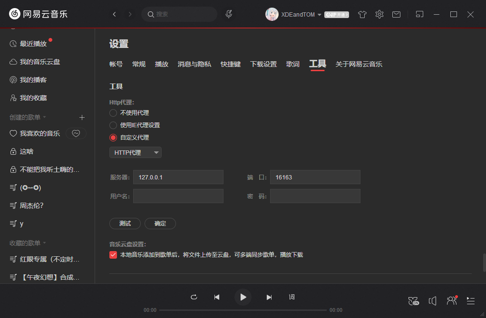

## 解锁网易云搭建-简单
本教程适合不会敲代码的小白
****


## 安装
点击下方链接下载exe可执行文件  
[https://hub.fastgit.org/Constaline/unblockneteasemusic-desktop/releases/download/1.3.5/unblockneteasemusic-desktop-1.3.5.exe](https://hub.fastgit.org/Constaline/unblockneteasemusic-desktop/releases/download/1.3.5/unblockneteasemusic-desktop-1.3.5.exe)  
下载完成后双击打开  
  
直接点下一步安装就行啦  
****
## 使用
打开网易云PC客户端  
进入设置  
点击工具  
找到http代理  
设置自定义代理  
输入  
服务器：`127.0.0.1`  
端口：`16163`  
  
点击确定然后重启即可  
## 进阶玩法-自定义音源
右键通知栏Constaline/unblockneteasemusic-desktop的图标  
选择Configuration  
就打开了配置文件  
我的配置：  
```
{
    "__instruction__": "After configuaration, please relaunch the app.",
    "__source_list__": [
        "pyncmd",
        "migu",
        "bilibili",
        "baidu",
        "kugou",
        "kuwo",
        "youtube",
        "qq",
        "joox"
    ],
    "source": [
        "migu",
        "pyncmd",
        "kugou",
        "kuwo"
    ],
    "port": 16163
}
```  
```
"port": 16163 //端口
```
这个我不会玩  
请自行研究吧  